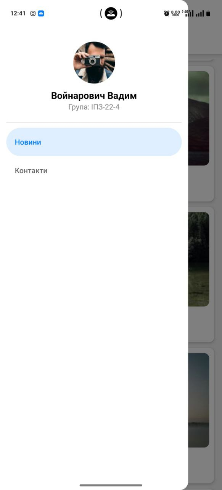

# Лабораторна робота №2

## Опис проєкту

У межах лабораторної роботи було розроблено мобільний застосунок на базі **React Native** з використанням бібліотеки **React Navigation**. У застосунку реалізовано вкладену навігацію, що поєднує **Drawer Navigator** та **Stack Navigator** для зручного переходу між екранами.

## Інструкція із запуску

### Встановлення середовища

1. **Встановіть Expo CLI:**
   ```bash
   npm install -g expo-cli
2. **Клонування репозиторію:**
   ```bash
   git clone https://github.com/ваш_профіль/MobileLabsRN2026.git
   cd MobileLabsRN2026/lab1
3. **Встановлення залежностей:**
   ```bash
   npm install
4. **Запуск додатку:**
   ```bash
   npm start
5. **Відкрийте Expo Go на вашому мобільному пристрої і відскануйте QR-код, що відображається в консолі, або використовуйте емулятор для запуску додатку.**

### Пояснення:
1. **Інструкція із запуску**:
   - Встановлення **Expo CLI**, клонується репозиторій, встановлюються залежності та запускається проект.
2. **Запуск на фізичному пристрої**:
   - Завантаження **Expo Go** на реальний пристрій і використання QR-коду для запуску додатку.
3. **Структура проєкту**:
   - Головна:
     * Головний екран відображає список новин за допомогою компонента FlatList, який забезпечує ефективне відображення великої кількості даних завдяки механізму віртуалізації. Під час натискання на новину відкривається екран з детальною інформацією, де параметри передаються між екранами через навігацію.
       <p align="center">
        
       </p>
       <p align="center">
         <em>Рис. 1 MainScreen</em>
       </p>
    - Деталі:
      * Екран деталей відображає зображення, назву та повний опис обраної новини. Дані передаються з головного екрана під час переходу через навігацію.
       <p align="center">
        
       </p>
       <p align="center">
         <em>Рис. 2 DetailsScreen </em>
       </p>
   - Контакти:
     * Також у застосунку реалізовано екран ContactsScreen, який використовує компонент SectionList для відображення контактів, згрупованих за секціями. Додатково було створено кастомне бокове меню (Drawer Menu) з інформацією про користувача та пунктами навігації.
       <p align="center">
        
       </p>
       <p align="center">
         <em>Рис. 3 ContactsScreen </em>
       </p>
   - Drawer:
     * У застосунку реалізовано кастомне бокове меню (Custom Drawer), яке замінює стандартний вигляд Drawer Navigator. У меню відображається аватар, ПІБ та група користувача, а також пункти навігації «Новини» та «Контакти».
       <p align="center">
        
       </p>
       <p align="center">
         <em>Рис. 4 Drawer Menu </em>
       </p>

## Висновок
У ході виконання лабораторної роботи було вивчено принципи побудови навігації у мобільних застосунках на основі React Native. Було реалізовано вкладену навігацію з використанням Drawer Navigator та Stack Navigator, що дозволило організувати зручну структуру переходів між екранами. Також було досліджено механізм передачі параметрів між екранами під час навігації.

Під час роботи було розглянуто особливості відображення великих списків даних. Для цього використано компоненти FlatList та SectionList, які забезпечують ефективну роботу зі списками завдяки механізму віртуалізації, що дозволяє відображати лише видимі елементи та зменшує навантаження на пам’ять.

У результаті було отримано практичні навички створення мобільного інтерфейсу, оптимізації відображення великих наборів даних та організації навігації між екранами, що є важливими аспектами розробки сучасних мобільних застосунків.
