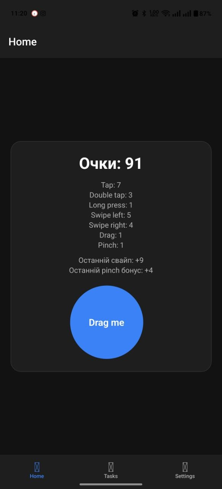
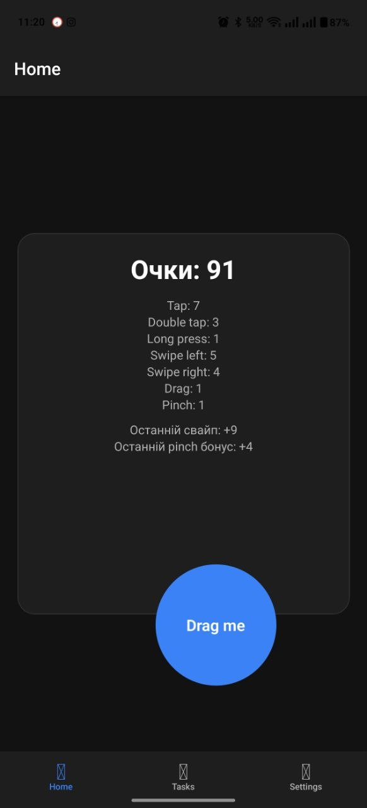
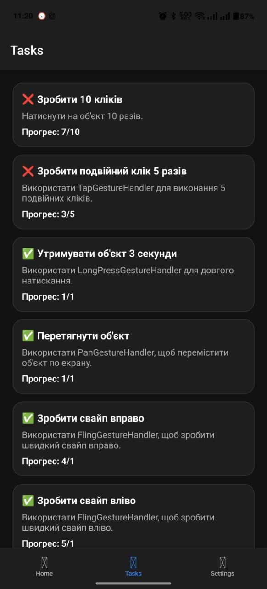
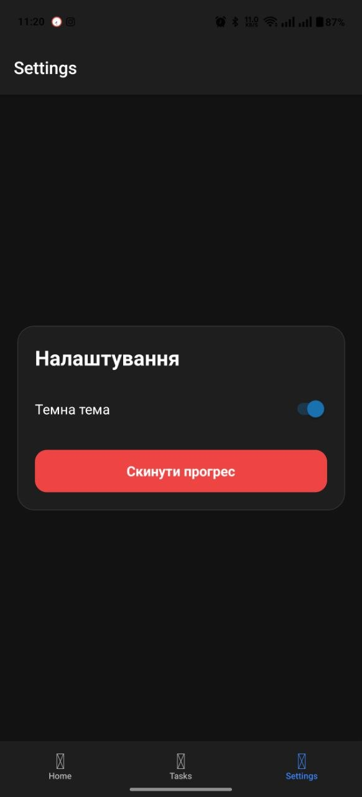

# Лабораторна робота №3

## 📌 Тема

Використання кастомних жестів у React Native та стилізація інтерфейсу мобільного застосунку.

## 🎯 Мета

Навчитися працювати з жестами користувача у мобільному застосунку, реалізувати взаємодію через різні типи жестів та застосувати сучасні підходи стилізації у React Native.

## 📱 Опис проєкту

У межах лабораторної роботи було розроблено мобільний застосунок — гру-клікер з використанням жестових взаємодій користувача.  
У застосунку реалізовано лічильник очок, інтерактивний об’єкт, сторінку із завданнями, сторінку налаштувань, навігацію між екранами та стилізацію інтерфейсу.

## ⚙️ Інструкція із запуску

### 1. Клонування репозиторію

```bash
git clone https://github.com/ваш_профіль/MobileLabsRN2026.git
cd MobileLabsRN2026/Lab_3
```

### 2. Встановлення залежностей

```bash
npm install
```

### 3. Запуск проєкту

```bash
npm start
```

### 4. Запуск на пристрої

Відкрийте застосунок у **Expo Go** на мобільному пристрої та відскануйте QR-код, або запустіть проєкт через емулятор.

## 🧩 Реалізований функціонал

### Головний екран

На головному екрані реалізовано лічильник очок та інтерактивний об’єкт, який реагує на жести користувача.

<p align="center">
  
</p>

<p align="center">
  <em>Рис. 1 Головний екран застосунку</em>
</p>

### Використання жестів

У застосунку реалізовано такі типи жестів:

- **TapGestureHandler** — коротке натискання для отримання очок;
- **TapGestureHandler** — подвійне натискання для отримання подвійної кількості очок;
- **LongPressGestureHandler** — бонусні очки за утримання натискання;
- **PanGestureHandler** — можливість перетягування об’єкта по екрану;
- **FlingGestureHandler** — свайп для отримання випадкової кількості очок;
- **PinchGestureHandler** — масштабування елемента для отримання бонусів.

<p align="center">
  
</p>

<p align="center">
  <em>Рис. 2 Взаємодія з об’єктом за допомогою жестів</em>
</p>

### Сторінка із завданнями

У застосунку створено сторінку із завданнями, де відображається список цілей та статус їх виконання.

Реалізовані завдання:

- зробити 10 кліків;
- зробити подвійний клік 5 разів;
- утримувати об’єкт 3 секунди;
- перетягнути об’єкт;
- зробити свайп вправо;
- зробити свайп вліво;
- змінити розмір об’єкта;
- отримати 100 очок;
- додати власне завдання.

<p align="center">
  
</p>

<p align="center">
  <em>Рис. 3 Сторінка із завданнями</em>
</p>

### Сторінка налаштувань

На сторінці налаштувань реалізовано можливість зміни параметрів застосунку.

<p align="center">
  
</p>

<p align="center">
  <em>Рис. 4 Сторінка налаштувань</em>
</p>

## 🧭 Навігація

Для переходу між екранами використано бібліотеку **React Navigation**.  
У застосунку реалізовано навігацію між головним екраном, сторінкою завдань та сторінкою налаштувань.


## 📂 Структура проєкту

```text
Lab_3/
├── assets/
├── screenshots/
├── src/
│   └── screens/
│   └── components/
├── .gitignore
├── App.js
├── app.json
├── index.js
├── package-lock.json
├── package.json
└── README.md
```

## ✅ Висновок

У ході виконання лабораторної роботи було розроблено мобільний застосунок у вигляді гри-клікера з використанням жестових взаємодій користувача.  
Було реалізовано різні типи жестів, зокрема коротке натискання, подвійне натискання, довге натискання, перетягування, свайпи та масштабування.

Також було створено сторінку із завданнями, реалізовано відображення статусу їх виконання, додано навігацію між екранами та виконано стилізацію інтерфейсу.  
У результаті було отримано практичні навички роботи з React Native, React Navigation, gesture-handler та сучасними підходами до оформлення мобільних застосунків.
