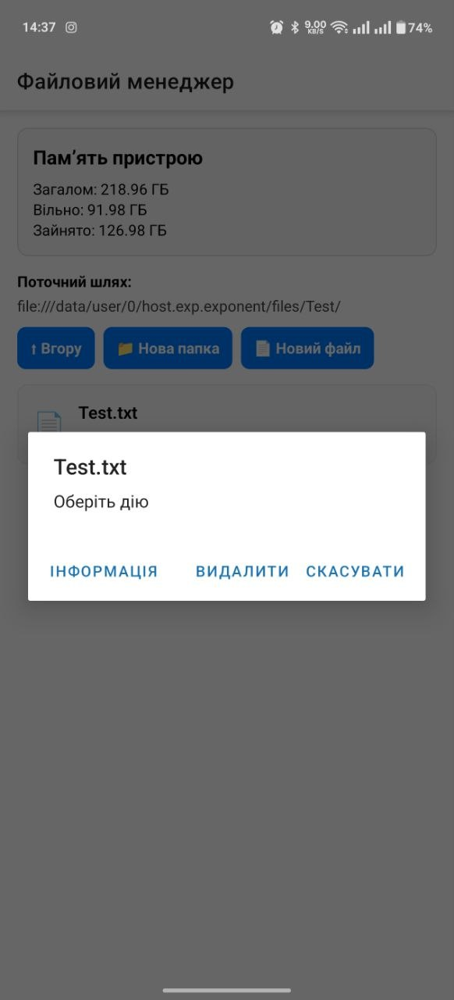

# Лабораторна робота №4

## Тема

Робота з файловою системою в React Native з використанням бібліотеки `expo-file-system`.

## Мета

Опанувати механізми роботи з локальною файловою системою мобільного пристрою, використовуючи можливості бібліотеки `expo-file-system`.

## Опис проєкту

У межах лабораторної роботи було розроблено мобільний застосунок **«Файловий менеджер»**.  
Застосунок дозволяє переглядати локальну файлову систему, створювати папки та текстові файли, відкривати й редагувати `.txt` файли, видаляти об’єкти та переглядати інформацію про файли.

## Інструкція із запуску

### 1. Клонування репозиторію

```bash
git clone https://github.com/VoinarovytchVadym/MobileLabsRN2026.git
cd MobileLabsRN2026/Lab_4
```

### 2. Встановлення залежностей

```bash
npm install
```

### 3. Запуск проєкту

```bash
npm start
```

### 4. Запуск на пристрої

Відкрийте застосунок через **Expo Go** на мобільному пристрої або запустіть його на емуляторі.

## Реалізований функціонал

### Навігація по файловій системі

На головному екрані реалізовано перегляд поточної директорії.  
Користувач може бачити поточний шлях, список файлів і папок, переходити у вкладені папки та повертатися до попередньої директорії.

<p align="center">
  
</p>

<p align="center">
  <em>Рис. 1 Навігація по файловій системі</em>
</p>

### Створення файлів і папок

У застосунку реалізовано створення нових папок та текстових файлів `.txt`.  
Для створення використовується модальне вікно з полями введення назви та початкового вмісту файлу.

<p align="center">
  
</p>

<p align="center">
  <em>Рис. 2 Створення файлів і папок</em>
</p>

### Перегляд і редагування текстових файлів

Текстові файли можна відкривати на окремому екрані редактора.  
На цьому екрані відображається вміст файлу, який можна змінити та зберегти.

<p align="center">
  
</p>

<p align="center">
  <em>Рис. 3 Перегляд і редагування текстового файлу</em>
</p>

### Видалення файлів і папок

Для файлів і папок реалізовано можливість видалення.  
Перед видаленням відображається вікно підтвердження дії.

<p align="center">
  
</p>

<p align="center">
  <em>Рис. 4 Видалення файлів і папок</em>
</p>

### Перегляд детальної інформації

Для обраного об’єкта файлової системи реалізовано екран детальної інформації.  
На ньому відображаються назва, тип, розмір, дата останньої модифікації та повний шлях до файлу або папки.

<p align="center">
  
</p>

<p align="center">
  <em>Рис. 5 Детальна інформація про файл або папку</em>
</p>

### Статистика памʼяті пристрою

На головному екрані відображається інформація про памʼять пристрою:

- загальний обсяг памʼяті;
- обсяг вільного простору;
- обсяг зайнятого простору.

<p align="center">
  
</p>

<p align="center">
  <em>Рис. 6 Статистика памʼяті пристрою</em>
</p>

## Структура проєкту

```text
Lab_4/
├── assets/
├── components/
├── screens/
│   ├── HomeScreen.js
│   ├── EditorScreen.js
│   └── InfoScreen.js
├── services/
│   └── fileSystemService.js
├── utils/
│   └── helpers.js
├── .gitignore
├── App.js
├── app.json
├── index.js
├── package-lock.json
├── package.json
└── README.md
```

## Висновок

У ході виконання лабораторної роботи було розроблено мобільний застосунок для роботи з локальною файловою системою.  
Було реалізовано навігацію між директоріями, створення папок і текстових файлів, відкриття та редагування `.txt` файлів, видалення файлів і папок, а також перегляд детальної інформації про об’єкти файлової системи.

Також було реалізовано відображення статистики памʼяті пристрою, що дозволяє переглядати загальний, вільний та зайнятий обсяг памʼяті.  
У результаті було отримано практичні навички роботи з бібліотекою `expo-file-system` у React Native.
