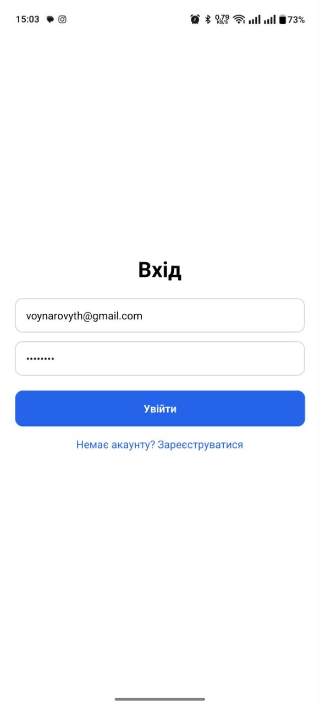

# Лабораторна робота №5

## Тема

Побудова навігації у React Native із використанням бібліотеки Expo Router.

## Мета

Ознайомлення з концепцією file-based маршрутизації в мобільних застосунках.

## Опис проєкту

У межах лабораторної роботи було розроблено мобільний застосунок з використанням **Expo Router**.  
У застосунку реалізовано публічні екрани авторизації та реєстрації, захищені маршрути, каталог товарів, сторінку деталей товару та обробку неіснуючих маршрутів.

## Інструкція із запуску

### 1. Клонування репозиторію

```bash
git clone https://github.com/VoinarovytchVadym/MobileLabsRN2026.git
cd MobileLabsRN2026/Lab_5
```

### 2. Встановлення залежностей

```bash
npm install
```

### 3. Запуск проєкту

```bash
npm start
```

### 4. Запуск на пристрої

Після запуску проєкту відкрийте застосунок через **Expo Go** на мобільному пристрої або запустіть його на емуляторі.

## Реалізований функціонал

### Контекст авторизації

У проєкті створено глобальний контекст авторизації, який зберігає стан користувача та містить функції для входу, реєстрації та виходу з акаунта.

[AuthContext.jsx](context/AuthContext.jsx)

### Екран входу

Створено публічний екран входу.  
Користувач може ввести email та пароль, після чого перейти до захищеної частини застосунку.

<p align="center">
  
</p>

<p align="center">
  <em>Рис. 2 Екран входу</em>
</p>

### Екран реєстрації

Створено публічний екран реєстрації.  
На екрані реалізовано поля для введення імені, email, пароля та підтвердження пароля.

<p align="center">
  
</p>

<p align="center">
  <em>Рис. 3 Екран реєстрації</em>
</p>

### Захищені маршрути

У групі маршрутів `app/(app)` реалізовано перевірку авторизації.  
Якщо користувач не авторизований, він перенаправляється на екран входу.

### Каталог товарів

У застосунку реалізовано каталог товарів.  
Список товарів формується на основі тестових даних, а кожен елемент містить зображення, назву, ціну та перехід на сторінку деталей.

<p align="center">
  
</p>

<p align="center">
  <em>Рис. 5 Каталог товарів</em>
</p>

### Деталі товару

Реалізовано динамічний маршрут для перегляду детальної інформації про товар.  
За допомогою параметра `id` визначається обраний товар, після чого відображаються його зображення, назва, ціна та опис.

<p align="center">
  
</p>

<p align="center">
  <em>Рис. 6 Деталі товару</em>
</p>

### Обробка неіснуючих маршрутів

У проєкті реалізовано екран для обробки неіснуючих маршрутів.  
На ньому відображається повідомлення про помилку та можливість повернення до головної сторінки.

[+not-found.jsx](app/+not-found.jsx)

## Структура проєкту

```text
Lab_5/
├── app/
│   ├── (app)/
│   │   ├── details/
│   │   │   └── [id].js
│   │   ├── _layout.js
│   │   └── catalog.js
│   ├── (auth)/
│   │   ├── login.js
│   │   └── register.js
│   ├── +not-found.js
│   └── _layout.js
├── assets/
├── screenshots/
├── context/
│   └── AuthContext.js
├── data/
│   └── products.js
├── .gitignore
├── app.json
├── babel.config.js
├── index.js
├── package-lock.json
├── package.json
└── README.md
```

## Висновки та відповіді на контрольні запитання

### 1. Яким чином за допомогою Expo Router реалізується перенаправлення неавторизованого користувача?

Перенаправлення реалізується у layout-файлі захищеної групи маршрутів.  
Якщо користувач не авторизований, повертається компонент `<Redirect href="/login" />`, який переводить користувача на екран входу.

### 2. У чому полягає різниця між використанням компонента `<Link>` та метода `router.push()`?

`<Link>` використовується для декларативного переходу між екранами без написання окремої функції.  
`router.push()` використовується програмно, коли перехід потрібно виконати після певної дії, наприклад після натискання кнопки або успішної авторизації.

### 3. Як працюють динамічні маршрути в Expo Router і як отримати передані параметри?

Динамічні маршрути створюються за допомогою файлів із квадратними дужками, наприклад `[id].js`.  
Передані параметри можна отримати за допомогою хука `useLocalSearchParams()`.  
У цій лабораторній роботі параметр `id` використовується для пошуку відповідного товару.

### 4. Чому стан авторизації доцільно зберігати у глобальному контексті?

Стан авторизації використовується в різних частинах застосунку, тому його зручно зберігати у React Context.  
Це дозволяє уникнути передавання даних через props між багатьма компонентами.

### 5. Для чого використовуються групи маршрутів `(folderName)` і як вони впливають на URL-адресу?

Групи маршрутів використовуються для логічного розділення екранів у проєкті.  
Наприклад, група `(auth)` містить екрани авторизації, а група `(app)` — захищені екрани.  
Назва групи не додається до URL-адреси, але допомагає організувати структуру застосунку.

## Загальний висновок

У ході виконання лабораторної роботи було реалізовано мобільний застосунок із використанням Expo Router.  
Було створено file-based маршрутизацію, публічні та захищені маршрути, контекст авторизації, каталог товарів і динамічний екран деталей.  
Також було реалізовано обробку неіснуючих маршрутів.

У результаті було отримано практичні навички роботи з Expo Router, React Context, динамічними маршрутами та організацією навігації у React Native застосунку.
