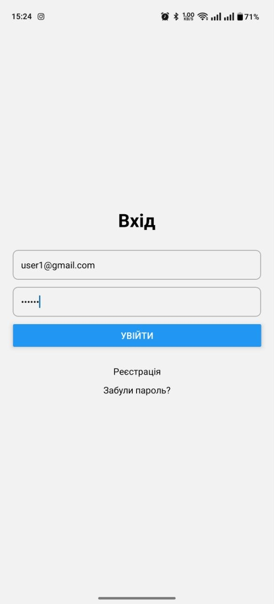
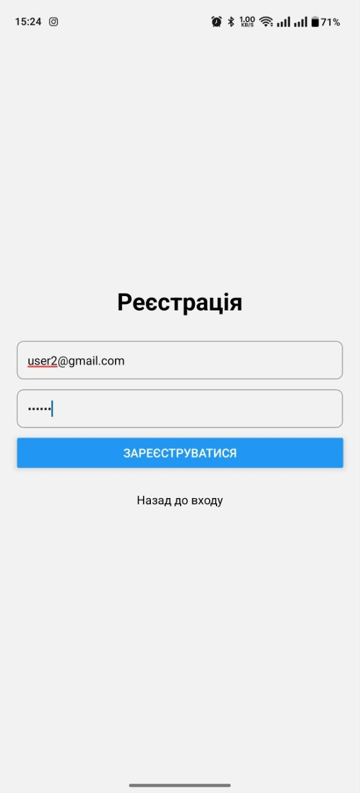
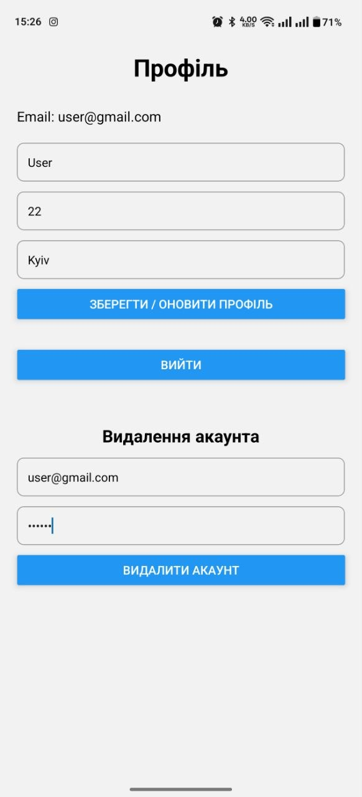

# Лабораторна робота №6

## Тема
Побудова авторизації та збереження персональних даних у React Native з використанням Firebase Authentication та Firestore.

## Мета
Набути практичних навичок інтеграції авторизації та обробки персональних даних користувача.

## Опис проєкту
У межах лабораторної роботи було розроблено мобільний застосунок з використанням Firebase.  
Застосунок дозволяє реєструватися, входити в систему, керувати профілем користувача та зберігати дані у Firestore.

## Інструкція із запуску

```bash
git clone https://github.com/VoinarovytchVadym/MobileLabsRN2026.git
cd MobileLabsRN2026/Lab_6
npm install
npm start
```

Відкрити через Expo Go або емулятор.

---

## Реалізований функціонал

### Авторизація
- реєстрація користувача (email + пароль)
- вхід у систему
- вихід із акаунта

<p align="center">
  
</p>
<p align="center">
  
</p>

---

### Робота з профілем
- введення та оновлення даних: ім’я, вік, місто
- збереження даних у Firestore

<p align="center">
  
</p>

---

### Редагування та видалення акаунта
- видалення акаунта з підтвердженням

<p align="center">
  
</p>
<p align="center">
  
</p>

---

### Відновлення паролю
- скидання паролю через email

<p align="center">
  
</p>

---

## Структура проєкту

```text
Lab_6/
├── app/
│   ├── (auth)/
│   ├── (app)/
│   └── _layout.js
├── context/
│   └── AuthContext.js
├── firebase/
│   └── config.js
├── services/
├── screenshots/
├── assets/
├── package.json
└── README.md
```

---

## Висновок

У ході виконання лабораторної роботи було реалізовано систему авторизації користувача з використанням Firebase Authentication та збереження персональних даних у Firestore.  
Було освоєно роботу з реєстрацією, входом, відновленням паролю, захистом даних користувача та інтеграцією Firebase у React Native застосунок.
